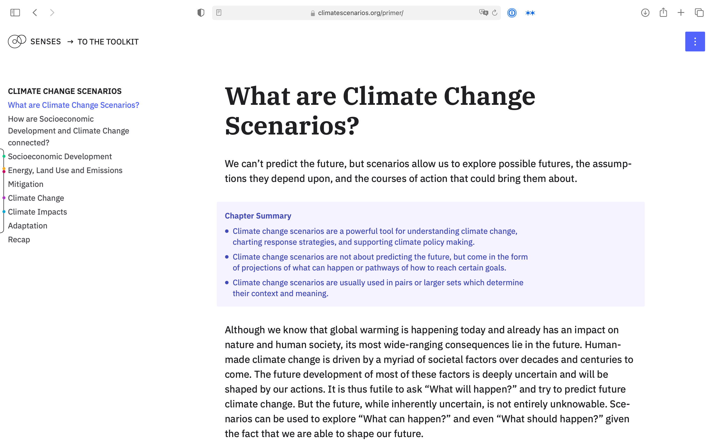

# Climate Change Scenario Primer

Interactive introduction into climate change scenarios



## License

The source code is licensed under the [ISC license](LICENSE.md). Text and graphics are licensed under [Attribution-ShareAlike 4.0 International](https://creativecommons.org/licenses/by-sa/4.0/). For licensing information on datasets please refer to the data sources section. Exceptions are listed below on a per-file basis.

## Data Soucres

Data sources and if applicable licenses are listed below on a per-file basis.

- `assets/data/scenarios/*` `assets/data/fingerprint-src.json`: [IAMC 1.5°C Scenario Explorer and Data hosted by IIASA](https://data.ene.iiasa.ac.at/iamc-1.5c-explorer/); [License for the IAMC 1.5°C scenario ensemble data](https://data.ene.iiasa.ac.at/iamc-1.5c-explorer/#/license)
- `assets/data/diff_annual_mean_tas_all-models-rcp26.nc.json` `diff_annual_mean_tas_all-models-rcp60.nc`: [Based on ISIMIP input data (simulated atmospheric climate)](https://www.isimip.org/gettingstarted/input-data-bias-correction/)

## Development

### Build Setup

``` bash
# install dependencies
$ npm install # Or yarn

# serve with hot reload at http://localhost:3000/primer/
$ npm run dev

# build for production and launch server
$ npm run build
$ npm start

# generate static project
$ npm run generate
# remove <base… in all index.html files (it breaks some svgs in safari and paths are absolute anyways)
sed -i '' 's/<base href="\/primer\/">//g' dist/index.html & sed -i '' 's/<base href="\/primer\/">//g' dist/*/index.html
```

For detailed explanation on how things work, checkout the [Nuxt.js docs](https://github.com/nuxt/nuxt.js).
